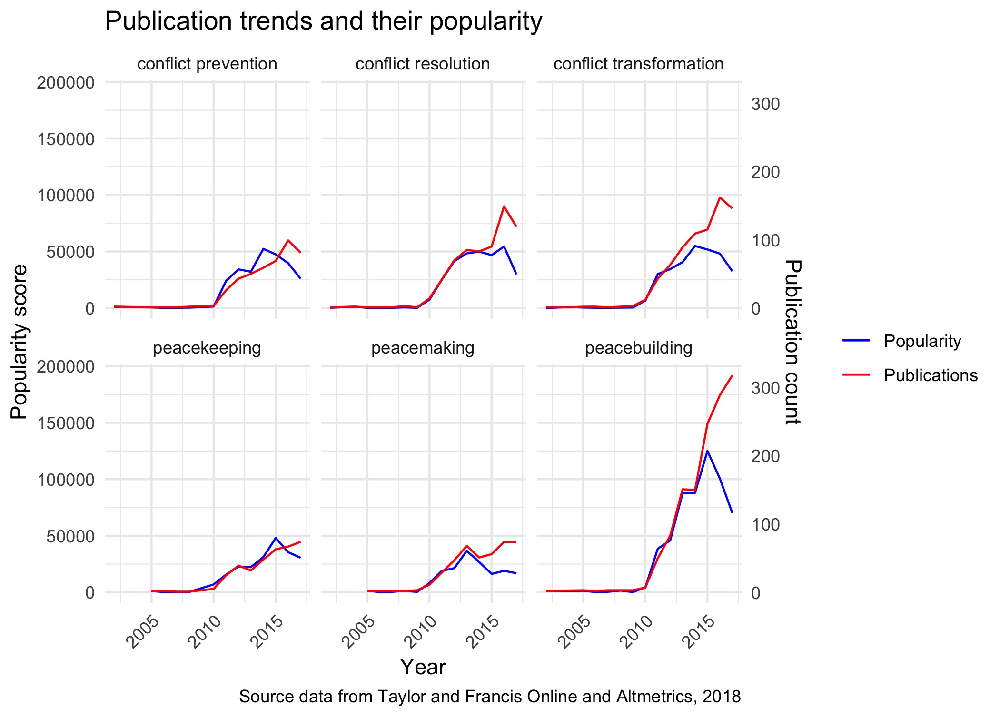
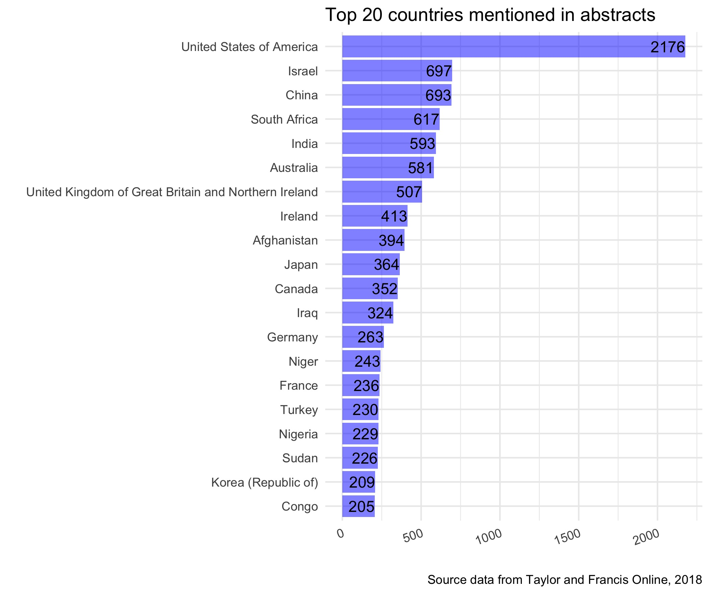
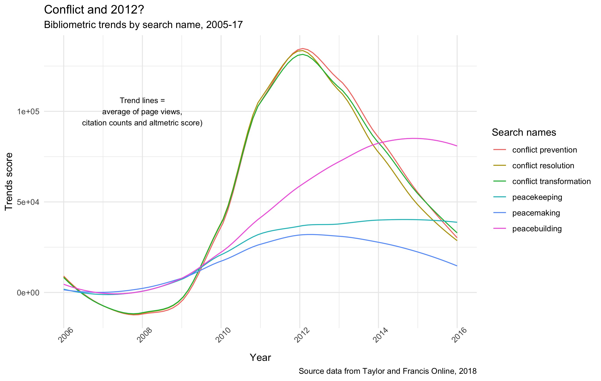

# Language in Peace and Conflict Studies

## Preamble

Are we moving into a new era of peace and conflict studies? Is peace and conflict studies losing it's following? Is the academe overtaking practice? Losing relevance? Overly theoretical? 2010 was certainly a boon for peace and conflict studies. Great change was afoot: the global financial crisis raised doubts in the good of globalisation; neoliberalism fall in favour with theorists , and out of favour with those living in it (everything was the fault of neoliberalism); geo-politics shifted towards Asia as America's grip on the world order slipped and the Europe Union's future was starting to become uncerain. Thus, a new era in the domain emerged, defined by peacebuilding and state-building, away from building the nation and the community. 

The figure above shows the popularity trends against publication outputs in the area since 2004. This data is derived from harvesting thousands of publication records from the Taylor and Francis Online repository, broken up by eight search terms, which could be considered sub-branches of Peace and Conflict Studies. Each grid above indicates the publication results for each of the eight search terms. (More about the project [below](#about)).

The interesting insight this figure above suggests is the emerging split between publication rates, and the popularity of these articles as gauged from a mixture of Altermetric data and web-page statistics from Taylor and Francis Online. As discussed below, whilst apparent across many of the domains of research in peace and conflict studies, the drop in popularity has been driven largely by areas like "nation-building" and "peacemaking". One could argue that we would have seen similar falls in "liberal peacebuilding" if criticising neoliberalism hadn't have been so popular over the past five years (myself guilty as charged). 

Keep in mind that this graph is based on the bibliometric data associated with each article, which is taken as a proxy for the article's general popularity. 

There's still so much to say about the data presented above, like the correlative relationships between couples such as state-building and nation-building or peacemaking and peacebuilding (one goes up, the other goes down), but I'll leave this for later.

## Contents

* [About the project](#about)
* [Initial results](#initial-results)
* [Where to](#where-to)

## About the project {#about}

This project is a meta-analysis of Peace and Conflict studies literature since 2005. The project involved building a web-scraping tool in R, feeding results into an SQL database, and perform some quantitative text analysis (also in R). 

I have used the [Taylor and Francis Online](https://www.tandfonline.com/) publication repository to obtain a significant sample of journal articles based on eight keyword searches. Here is a list of the searches performed:

**practical approaches to peace and conflict**
* "peacebuilding"
* "peacemaking"
* "peacekeeping"
* "conflict prevention"
* "conflict resolution"
* "conflict transformation"

**proxy areas**
* "state-building"
* "nation-building"

**meta-theoretical areas**
* "liberal peacebuilding"
* "peace and conflict studies"

For each search ~5000 articles were collected, except for liberal peacebuilding which returned 100% search coverage of 1,846 articles. The results contain each article's title, publication date, authors, abstract, the full journal text and bibliometrics published on the article's webpage such as citations and views. 

First, I will be using this data to look at article popularity, profile the top countries mentioned, compare trends between searches. 

Second, I will be performing text analysis on the language used in titles, abstracts and the full text to ascertain common themes. This will also be broken down by search term.

Finally, I won't to identify the level of prescriptiveness/teleology in the articles, by search term (see [Where to](#where-to)).

After some data processing, this project collected the following number of articles by search term:

### Coverage
<iframe width="800" height="371" seamless frameborder="0" scrolling="no" src="https://docs.google.com/spreadsheets/d/e/2PACX-1vRQIsodC2Z9_9FdKCspFuvlCee87lK4IB4MrjBSo-qVyzebVeNdc9QtWhaPm1pfOkWw6G69ZGLCzgix/pubchart?oid=1351741946&amp;format=interactive"></iframe>

### Metric data
<iframe width="800" height="371" seamless frameborder="0" scrolling="no" src="https://docs.google.com/spreadsheets/d/e/2PACX-1vRQIsodC2Z9_9FdKCspFuvlCee87lK4IB4MrjBSo-qVyzebVeNdc9QtWhaPm1pfOkWw6G69ZGLCzgix/pubchart?oid=952477040&amp;format=interactive"></iframe>

### Country mentions
<iframe width="800" height="371" seamless frameborder="0" scrolling="no" src="https://docs.google.com/spreadsheets/d/e/2PACX-1vRQIsodC2Z9_9FdKCspFuvlCee87lK4IB4MrjBSo-qVyzebVeNdc9QtWhaPm1pfOkWw6G69ZGLCzgix/pubchart?oid=1121924922&amp;format=interactive"></iframe>

## Initial results {#initial-results}

## Country mentions
### In titles

### In abstracts

## Bibliometrics 

## Where to 
### The is-ought problem

*Liberal peacebuilding is teleological* (e.g., [Greener, 2013](https://www.tandfonline.com/doi/abs/10.1080/17502977.2012.733575?src=recsys&journalCode=risb20),[Richmond, 2006](https://www.tandfonline.com/doi/abs/10.1080/14678800600933480?src=recsys&journalCode=ccsd20), [Richmond & Franks, 2007](https://www.researchgate.net/publication/240701003_Liberal_Hubris_Virtual_Peace_in_Cambodia))

*Peacebuilding and statebuilding is social engineering* (e.g., [Richmond, 2013](https://www.tandfonline.com/doi/abs/10.1080/13698249.2010.484909?journalCode=fciv20), [Goodhand & Mark Sedra](https://books.google.com.au/books?id=M4D7CwAAQBAJ&pg=PA1&lpg=PA1&dq=Peacebuilding+and+statebuilding+is+social+engineering&source=bl&ots=iTkjj1Haa1&sig=jScITjMJKtogN5RDdwktSyIJX5w&hl=en&sa=X&ved=0ahUKEwimu9eRiN_bAhVCI5QKHTeWBrAQ6AEINjAD#v=onepage&q=Peacebuilding%20and%20statebuilding%20is%20social%20engineering&f=false))

“The apparent gap between "is" statements and "ought" statements, when combined with Hume's fork, renders "ought" statements of dubious validity. Hume's fork is the idea that all items of knowledge are either based on logic and definitions, or else on observation. If the is–ought problem holds, then "ought" statements do not seem to be known in either of these two ways, and it would seem that there can be no moral knowledge.”

This project intends to identify the linguistic and academic trends in peacebuilding literature. It is particularly concerned with what some have called the teleological or prescriptive nature of the literature in the area. It attempts to quantitatively locate trends in the language used and identify any "ought" statements: i.e., a statement of the form "In order for agent A to achieve goal B, A reasonably ought to do C" exhibits no category error and may be factually verified or refuted. "Oughts" exist, then, in light of the existence of goals.
> For instance, a pair of scissors that cannot easily cut through paper can legitimately be called bad since it cannot fulfill its purpose effectively. Likewise, if a person is understood as having a particular purpose, then behaviour can be evaluated as good or bad in reference to that purpose. In plainer words, a person is acting good when that person fulfills that person's purpose.
> Eg., “ought” statements (within one or two sentences) with state-affirming terms like peace, community or nation can be used prescriptively

## Research questions
* What linguistic and publishing trends have existed over the past 20 years and how do related publication areas compare?
* What proportion of articles contain prescriptive sentences (%)?
* Is there a significant difference between proportion of prescriptive sentences with state-affirming terms between sample from Development studies, Peace and Conflict studies, Peacebuilding and Political science literature?

